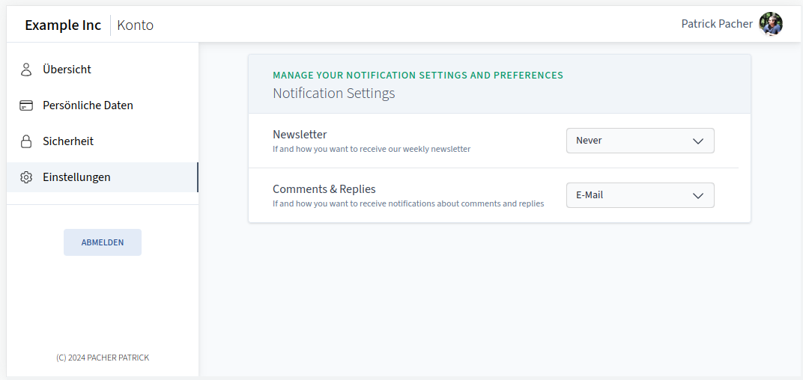
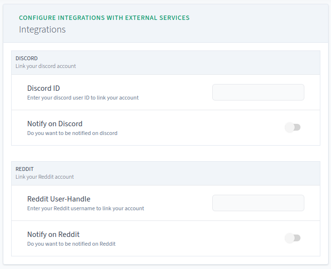

---
next:
  text: Policies
  link: ./policies.md
---

# Additional User Fields

Although cisidm already provides common user information (see [Users](#users)),
there may be use-cases where additional user metadata needs to be stored. In
order to avoid requiring a dedicated service to store this metadata, `cisidm`
provides support for custom user fields. Those fields are stored in the database
as a **JSON blob**.

Custom fields may either be used by services that directly integrate with
`cisidm` using the API or may also be used in [Policies](./policies.md) to implement
Attribute-Based-Access-Control (ABAC).

To add custom user fields, you need configured them in the configuration file.

::: tip Examples
Head over to [Use-Cases and Examples](#use-cases-and-examples) for some ideas.
:::

## Field Types

`cisidm` supports the following field types:

| **Type** 	| **Comment**                                                                                                                                           	|
|----------	|-------------------------------------------------------------------------------------------------------------------------------------------------------	|
| `string` 	| A text value                                                                                                                                          	|
| `number` 	| A number value                                                                                                                                        	|
| `bool`   	| A boolean value                                                                                                                                       	|
| `date`   	| A date value in the format of `YYYY-MM-DD`                                                                                                            	|
| `time`   	| A time value in the format of `HH:MM`                                                                                                                 	|
| `object` 	| A JSON object. Allowed properties must be configured in the configuration file using `property` blocks and may have any of the supported field types. 	|
| `any`    	| A special field type that instructs `cisidm` to not perform any validation. `any` fields cannot be seen or edited in the user-interface.              	|
| `list`   	| A JSON list. The element-type must be set using the `element_type` block. List values cannot be seen or edited in the user-interface for now.         	|

::: warning User-Interface Support

The user-interface does not yet support `list` and `any` types!

:::

## Field Visibility

Each field has a visibility specified that instructs `cisidm` who is allowed to see
the field.

| **Visibility** |  **Comment**                                                                  |
|----------------|-------------------------------------------------------------------------------|
| `private`      | Only administrators/services that integrate with cisidm can see those fields. |
| `self`         | A user can only see his/her own field                                         |
| `public`       | Every authenticated user can see the field for each other user                |

::: tip Inheritance

If `visibilty` or `writeable` is not defined for `object` properties than the value of the parent field is inherited.
If top-level fields do not specify a visibility it always defaults to `self`.
Fields are writeable by default.

:::

## Configuration

The definition of a custom user field looks like the following:

```hcl
# Possible values for <field-type> are:
#  - string
#  - number
#  - bool
#  - date
#  - time
#  - object
#  - list
#  - any
field "<field-type>" "<field-name>" {
    # Possible values are: "private", "self", "public"
    visibility = "<visibility>"

    # Whether or not the field is writeable
    writeable = true

    # A custom display name for the field in the User-Interface.
    display_name = ""

    # A custom description for the field in the User-Interface.
    description = ""

    # Property defines an object property.
    # Those blocks are only allowed if the field-type is set to "object".
    # A property block may be specified multiple times.
    property "<property-type>" "<property-name>" {
        # Defines a object property. This is exactly the same as the "field" block
        # so objects, lists and fields may be nested in any way
    }

    # ElementType defines the type of list elements.
    # This block is only allowed if the field-type is set to "list".
    # A element_type block must be specified exactly once for "list"s.
    element_type "<element-type>" "<element-name>" {
        # Defines a lists element type. This is exactly the same as the "field" block
        # so objects, lists and fields may be nested in any way
    }

    # For "string" fields, it is possible to define a set of allowed values using
    # multiple `value` blocks.
    # The "<value>" is the actually stored value for this field while the optional
    # display_name stanza may be used to provide a better human value representation.
    #
    # As soon as at least one `value` block is defined `cisidm` does not allow
    # other values for this field and the user-interface will render a select
    # box instead of a simple text field.
    value "<value>" {
        display_name = "<display-name>"
    }
}
```

## Use-Cases and Examples

Below are a few examples on how to configure custom fields. Refer to the
[Configuration File Reference](./config-reference.md) for more information.

### Notification Settings

When integrating your apps directly with `cisidm`s API you may want to allow your
users to update their notification preferences without needing to store those
settings directly in your application.



One can easily add support for notification settings like this:

```hcl
field "object" "notificationSettings" {
    visibility = "self"
    writeable = true
    display_name = "Notification Settings"
    description = "Manage your notification settings and preferences"

    property "string" "newsletter" {
        display_name = "Newsletter"
        description = "If and how you want to receive our weekly newsletter"

        value "never" {
            display_name = "Never"
        }

        value "email" {
            display_name = "E-Mail"
        }

        value "sms" {
            display_name = "SMS"
        }

        value "both" {
            display_name = "E-Mail + SMS"
        }
    }

    property "string" "comments" {
        display_name = "Comments & Replies"
        description = "If and how you want to receive notifications about comments and replies"

        value "never" {
            display_name = "Never"
        }

        value "email" {
            display_name = "E-Mail"
        }

        value "sms" {
            display_name = "SMS"
        }

        value "both" {
            display_name = "E-Mail + SMS"
        }
    }
}
```

Your application than just needs to check the `extra` property of the user profile.
For example, using `idmctl`:

```bash
$ idmctl users get-extra alice "notificationSettings.newsletter"
"never"

$ idmctl users get-extra alice "notificationSettings"
{ "newsletter": "never", "comments": "email" }
```

### External Service Integration

Imagine your app having support to send messages to your users on Discord or Reddit
but those integrations must be enabled by each user on it's own:



<CodeGroup>
  <CodeGroupItem title="config.hcl">

```hcl
field "object" "integrations" {
    display_name = "Integrations"
    description = "Configure integrations with external services"

    property "object" "discord" {
        display_name = "Discord"
        description = "Link your discord account"

        property "string" "id" {
            display_name = "Discord ID"
            description = "Enter your discord user ID to link your account"
        }

        property "bool" "notify" {
            display_name = "Notify on Discord"
            description = "Do you want to be notified on discord"
        }
    }

    property "object" "reddit" {
        display_name = "Reddit"
        description = "Link your Reddit account"

        property "string" "handle" {
            display_name = "Reddit User-Handle"
            description = "Enter your Reddit username to link your account"
        }

        property "bool" "notify" {
            display_name = "Notify on Reddit"
            description = "Do you want to be notified on Reddit"
        }
    }
}
```

  </CodeGroupItem>
</CodeGroup>

### Attribute-Based-Access-Control (ABAC)

Custom user fields can also be used to implement ABAC:

<CodeGroup>
  <CodeGroupItem title="config.hcl">

```hcl
field "string" "department" {
    # Users can see their assigned department
    visibility = "self"

    # But are not allowed to change them (only administrators can set those
    # fields)
    writeable = false

    display_name = "Department"

    value "HR" {}
    value "Support" {}
    value "Development" {}
    value "Management" {}
}
```

  </CodeGroupItem>
</CodeGroup>

Then one can use those fields in rego policies (See our [Policies Guide](./policies)):

<CodeGroup>
  <CodeGroupItem title="policy.rego">

```rego
package cisidm.forward_auth

import rego.v1

default allow := false

allow if {
    input.subject
    input.subject.fields["department"] = "HR"
    input.host = "hr.example.com"
}

allow if {
    input.subject
    input.subject.fields["department"] in ["Development", "Support"]

    input.host in ["prod.example.com", "dev.example.com"]
}
```

  </CodeGroupItem>
</CodeGroup>

## Setting fields

While users can update `writeable` non-`private` fields via the user-interface,
as an administrator, you may set all fields using the idmctl commandline
utility:

```bash
idmctl users set-extra [user] [path] [value]

# Examples:
idmctl users set-extra alice "notification-settings.sms" true
idmctl users set-extra alice "internal-phone-extenstion" '"34"'
```

:::tip Note

Values should be encoded in their JSON representation. For example, the
following should also work:

```bash
idmctl users set-extra alice                    \
    "notification-settings"                     \
    '{"sms": true, "email": false}'
```

:::

