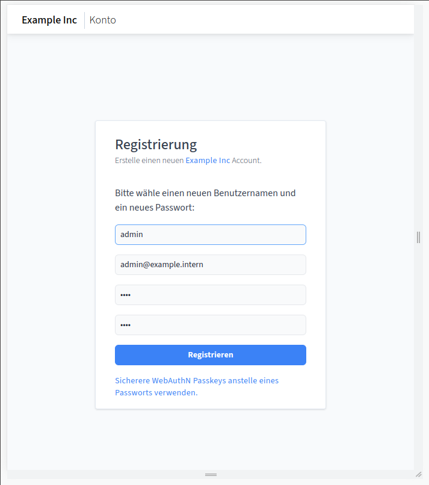
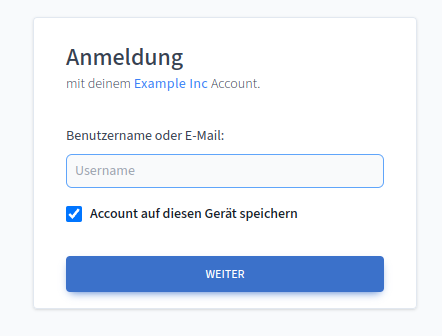

---
next:
  text: User and Role Management
  link: ./user-role-management.md
---

# Getting Started

Welcome to the Getting-Started Guide for `cisidm`. On this page we will walk
through a simple docker-compose based setup to get you started.

::: tip Introduction

If you just want to find out what `cisidm` is and what it was designed for head
over to the [Introduction](./intro.md)

:::

<br>
<hr>

**Contents**

[[toc]]

<hr>

## Overview

The easiest way to get started using `cisidm` is to deploy it using
docker-compose. In this guide we will setup a docker deployment with the
following service:

- [**traefik**](https://doc.traefik.io/traefik/):  
  A flexible and powerful reverse proxy that will handle automatic HTTPS via
  Let's Encrypt and secure our services by enforcing authentication via cisidm.

- [**cisidm**](https://github.com/tierklinik-dobersberg/cis-idm):  
  The identity management server.

- [**echoserver**](https://gcr.io/google_containers/echoserver:1.4):  
  A simple demo application that will be secured using cisidm and traefik.

:::warning Domain Names

This example uses the following domain-names for testing purposes. You will
likely need to add those domains to your `/etc/hosts` file!

Add the following content to `/etc/hosts`:

@[code plain](../../../examples/getting-started/hosts)

:::

## Setup the Project

**The whole example can be found in the [GitHub repository](https://github.com/tierklinik-dobersberg/cis-idm/tree/main/examples/getting-started).**

Clone the `cisidm` repository and enter the project directory.

```bash
git clone https://github.com/tierklinik-dobersberg/cis-idm

cd cis-idm/examples/getting-started
```

All configuration files in this example are ready to go, for reference, we will
still show them below and explain the important pieces.

Before you start, you should make sure that your `/etc/hosts` file contains the
required "DNS" entries for this example:

```bash
sudo bash -c "cat ./hosts >> /etc/hosts"
```

## cisidm Configuraton File

The configuration file for `cisidm` is located in the `idm.hcl` file and has the
following content:

<CodeGroup>
  <CodeGroupItem title="idm.hcl">

@[code hcl](../../../examples/getting-started/idm.hcl)

  </CodeGroupItem>
</CodeGroup>

::: tip

Refer to the [Configuration File Reference](../architecture/config-reference.md)
for a more detailed explanation of the configuration file.

:::

## The docker-compose file

We also need a `docker-compose.yml` file that contains our service and container
definitions. It has the following content:

<CodeGroup>
  <CodeGroupItem title="docker-compose.yml">

@[code yaml](../../../examples/getting-started//docker-compose.yml)

  </CodeGroupItem>
</CodeGroup>

We'll explain the important bits below:

:::tip

If you're already familiar with docker-compose you can skip over the explanation
to the next section [here](#start-the-project).

:::

Let's break it down a bit:

```yaml
version: "3"

volumes:
  db:
```

This just tells docker-compose which file-version we're using and that we want a
volume named `db` that will hold our sqlite3 database.


### Traefik Container

@[code{7-25} yaml:no-line-numbers](../../../examples/getting-started/docker-compose.yml)

The above service snippet configures Traefik as our reverse proxy. Let's go
through the arguments passed to Traefik:

- `--api.insecure=true`  
  This enables the management dashboard of Traefik. This is useful for debugging
  service configurations. The management dashboard will be accessible on port
  8080:

- `--providers.docker=true`,  
  `--providers.docker.exposedbydefault=false`  
  This enables the docker provider so we can configure Traefik using container
  labels. This will be explained in more detail below.

- `--entrypoints.http.address=:80`,  
  Tell traefik that we want to have one entrypoint on port 80 named `http`

### cisidm Container

@[code{27-45} yaml:no-line-numbers](../../../examples/getting-started/docker-compose.yml)

This configures the `cisidm` docker container, mounts the configuration file to
`/etc/config.hcl` and tells traefik that is should be reachable at
`account.example.intern`.

It also configures a new HTTP middleware `auth` that uses the forward-auth
feature of traefik:

- `traefik.http.middlewares.auth.forwardauth.address=http://cisidm:8080/validate`  
  This configures the Forward-Auth middleware (named `auth` here) to forward any
  HTTP request to cisidm to determine if the user is actually allowed to access
  the requested resource. If cisidm replies with a HTTP success status code
  (2xx) than traefik will forward the original request to the actual service
  container. If cisidm replies with an error code, traefik will immediately
  return the response from `cisidm` to the user. This is used to redirect the
  user to the login page in case the request is unauthenticated.

- `traefik.http.middlewares.auth.forwardauth.authResponseHeaders=....`  
  When `cisidm` successfully authenticated a request, it will return a set of
  headers that contain information about the logged in user. With this setting,
  we tell traefik to forward those headers to the actual service container. This
  enables service containers to know which user performs the access without the
  need to parse and validate the JWT token issued by `cisidm` for every
  successful authentication.

### Echoserver

Finnally, our `docker-compose.yml` file contains a simple echo server that we
want to be protected by cisidm:

@[code{46-59} yaml:no-line-numbers](../../../examples/getting-started/docker-compose.yml)

## Start the Example

Finally it's time to start our services by calling the following command from
the example directory (`examples/getting-started`):

```bash:no-line-numbers
docker-compose up -d
```

After a couple of minutes (depending on how many docker containers need to be
downloaded) you example project should be up and running!

Since this is the first-start of `cisidm`, there's no administrative user yet.
Even though registration is `disabled` in the cisidm configuration it is still
possible to register once. This user will automatically be assigned the
`idm_superuser` role.

Open up [http://account.example.intern/registration](http://account.example.intern/registration)
and create your admin account:

<center>



</center>

After a successful registration you will be redirected to your cisidm profile
page where you can complete your profile information, upload a user avatar and
more.

:::tip Registration using the cli

It's also possible to use the `idmctl` cli utility to register your account:

```bash:no-line-numbers
idmctl register my-username --password my-password
```

:::


**For demonstration purposes it's best to click the "Logout" button now so you
can see the full authentication flow when accessing the demo application.**

Awesome, let's try the example application by opening [http://app.example.intern](http://app.example.intern) in your web-browser.

If you clicked "logout" on the profile view before you will now be redirected to
the login screen of cisidm:

<center>



</center>

Once you complete the login flow, cisidm will redirect to back to the protected
application.

The `echoserver` application just dumps the HTTP request that it received (your
response might look a bit different):

```plain{26-30}
CLIENT VALUES:
client_address=172.26.0.3
command=GET
real path=/
query=nil
request_version=1.1
request_uri=http://app.example.intern:8080/

SERVER VALUES:
server_version=nginx: 1.10.0 - lua: 10001

HEADERS RECEIVED:
accept=text/html,application/xhtml+xml,application/xml;q=0.9,image/avif,image/webp,image/apng,*/*;q=0.8,application/signed-exchange;v=b3;q=0.7
accept-encoding=gzip, deflate
accept-language=de,en-US;q=0.9,en;q=0.8
cookie=cis_idm_access=<REDACTED>
host=app.example.intern
referer=http://account.example.intern/
upgrade-insecure-requests=1
x-forwarded-for=172.26.0.1
x-forwarded-host=app.example.intern
x-forwarded-port=80
x-forwarded-proto=http
x-forwarded-server=db8c46e822b1
x-real-ip=172.26.0.1
x-remote-avatar-url=http://account.example.intern/avatar/23fa762e-0267-41e5-aa7c-7bc28a462e8a
x-remote-mail=admin@example.intern
x-remote-role=idm_superuser
x-remote-user=admin
x-remote-user-id=23fa762e-0267-41e5-aa7c-7bc28a462e8a
BODY:
-no body in request-
```

As you can seen between lines **26 and 30**, `cisidm` authenticated the request and
added remote-headers so your applications and services can just rely on the presence
of those headers to know which user is logged-in.

<br />

::: warning Open-ID-Connect (OIDC)

Unfortunately there are lots of services that don't support user authentication
using remote headers. Though, if this is an issue you might still be able to
provide a Single-Sign-On experience to your users by using Open-ID-Connect
(OIDC).

[**Checkout our OIDC Guide for an example!**](./setup-oidc.md)

:::

---

<br />

:::tip Congratulations

You just finished setting up cisidm with a reverse proxy that will now protect
your services using Proxy/Forward Authentication.

Now it's time to check the [User and Role Administration
Guide](./user-role-management.md) or the [Command Line
Reference](./cli-reference.md).

:::
