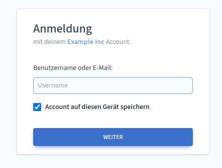

# OpenID Connect Setup

While `cisidm` does not implement OIDC itself it is very easy to add support for
Open-ID-Connect using the [DexIdp](https://dexidp.io/) project. It integrates
with `cisidm` using the
[**AuthProxy**](https://dexidp.io/docs/connectors/authproxy/) provider.

In this mode, OIDC clients ask DexIdp for authentication/authorization which in
turn takes authenticated user information from HTTP request headers that have
been added by `cisidm` during the forward-authentication.

For self-hosted environments it is also possible to configure DexIdp to skip the
consent screen and directly redirect the user to the requested application
providing a seamless Single-Sign-On experience.

We have tested OIDC support based on DexIdp with [Rallly](https://rallly.co),
[WikiJS](https://js.wiki/), [Outline](https://www.getoutline.com/) and
[Nextcloud](https://nextcloud.com). It's expected that every OIDC client will
work with this setup.

## Contents

[[toc]]

## Example Setup

This section presents an example setup of using `cisidm` together with DexIdp
to enable OIDC support. We will also deploy Rallly and configure it to use
Single-Sign-On usig OIDC.

**The whole example can be found in the [GitHub repository](https://github.com/tierklinik-dobersberg/cis-idm/tree/main/examples/oidc).**

::: warning Network Mode

Do to the nature of how OAuth2 and OIDC work (with a couple of redirects),
the following example requires that all services in the docker-compose.yml
are configured to run in `network_mode: host`.

If you have public DNS entries it would work with normal docker networking as
well!

:::

Let's create the different configuration files we need:

<CodeGroup>
  <CodeGroupItem title="docker-compose.yml">

@[code yaml](../../../examples/oidc/docker-compose.yml)

  </CodeGroupItem>

  <CodeGroupItem title="idm.hcl">

@[code hcl](../../../examples/oidc/idm.hcl)

  </CodeGroupItem>

  <CodeGroupItem title="dex.yml">

@[code yaml](../../../examples/oidc/dex.yml)

  </CodeGroupItem>
</CodeGroup>

In this example we're using the domains `account.example.intern`, `oidc.example.intern` and `rallly.example.intern`. For
testing purposes you should add them to your `/etc/hosts` file. Add the following entry:

```
127.0.0.1   oidc.example.intern account.example.intern rallly.example.intern example.intern
```

## Starting the example

First, clone the cis-idm repo to your local machine and enter the example directory:

```
git clone https://github.com/tierklinik-dobersberg/cis-idm

cd cis-idm/examples/oidc
```


Before we can run `docker-compose up` to bring up the example we first need to build
the `cisidm` container (we could also use the official container image from the
ghcr.io registry):

```bash
docker-compose build
```

Once the container build is done we can start up the example:

```
docker-compose up
```

After a couple of minutes (depending on the required download size for the docker containers),
everything should be up and running.

Now, we need to create a new cisidm admin user. Even though registration is set to
`disabled` in `idm.hcl`, cisidm will at least permit the very first user to register
and will assign administrative priviledges.

Open the following URL in your web-browser: [http://account.example.intern/registration](http://account.example.intern/registration).

<center>


</center>

Once you completed the registration you will be redirected to your profile page
in cisidm.

::: tip Logout 
For testing and demonstration purposes you should now click on "Logout".
:::

Next, we can open up Rallly: [http://rallly.example.intern](http://rallly.example.intern):

<center>


</center>

Finnaly, you just need to click on "Login with Example Inc". Rallly will now redirect
to DexIDP for authentication. Since you're not logged in `cisidm` will intercept
the redirect to the DexIDP `/callback` and redirect you to the login page.

Now enter your credentials and press "Login".

<center>



</center>

Once you finish the login process, cisidm will redirect you to the DexIDP callback
endpoint but this time, the request is authenticated and DexIDP will see the remote
user headers.

Since the request is authenticated, DexIDP will issue a new access/refresh token
and redirect you back to Rallly.

Sounds complicated? **It is!**  

But as a user you don't really see any of those redirect.
You just click on "Login with Example Inc", enter your cisidm credentials and immediately
are logged into Rallly.

### Cleanup

Finally, hit `CTRL-C` in the terminal that is running `docker-compose up`.
Once all containers are stopped, execute the following to clean-up everything 
(including the databases!):

```bash:no-line-numbers
docker-compose down -v
```